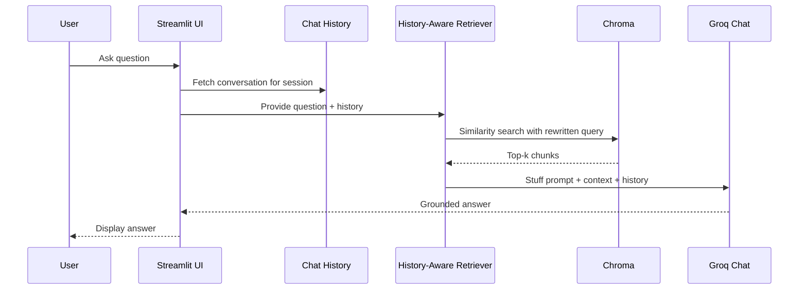

## Conversational RAG with PDF Uploads and Chat History


### What is this project?
An end‑to‑end, production‑ready Conversational Retrieval-Augmented Generation (RAG) app built with Streamlit. Users upload a PDF, the app indexes it into a vector database, and a chat interface answers questions grounded in the document while preserving conversational context across turns.

### Key features
- **PDF ingestion**: Upload a single PDF; pages are parsed and chunked.
- **RAG pipeline**: Embeddings + vector search + LLM‑based answer synthesis.
- **Chat history awareness**: Questions are contextualized using prior conversation turns.
- **Local vector store**: Chroma for fast similarity search.
- **Modern UI**: Streamlit app with session management.

---

## Methods used

- **Document loading**: `PyPDFLoader` extracts pages from the uploaded PDF.
- **Chunking**: `RecursiveCharacterTextSplitter` creates overlapping chunks (size ~5000, overlap ~500) to balance retrieval recall and context coherence.
- **Embeddings**: `HuggingFaceEmbeddings` with `all-MiniLM-L6-v2` for compact, high‑quality sentence embeddings.
- **Vector store**: `Chroma` stores and retrieves top‑k relevant chunks via cosine similarity.
- **History‑aware retrieval**:
  - `create_history_aware_retriever` re‑writes the current user question into a standalone query using chat history.
  - `create_retrieval_chain` pulls relevant chunks for the rewritten query.
- **Answer synthesis**: `create_stuff_documents_chain(llm, prompt)` combines retrieved context with a structured prompt to generate grounded answers.
- **Conversation state**: `RunnableWithMessageHistory` persists messages per `session_id` via `ChatMessageHistory`.

---

## Architecture (graph)

```mermaid
flowchart LR
    U[User] -->|Upload PDF / Ask| S[Streamlit UI]
    S --> L[PDF Loader (PyPDFLoader)]
    L --> T[Text Splitter (RecursiveCharacterTextSplitter)]
    T --> E[Embeddings (HF all-MiniLM-L6-v2)]
    E --> V[(Chroma Vector DB)]
    S --> H[Chat History]
    H --> Q[History-Aware Question Rewriter]
    Q --> R[Retriever]
    R --> V
    V --> C[Context Docs]
    C --> A[LLM Answer Synthesizer]
    A --> S
```

### Sequence (inference path)


---

## Quickstart

### Prerequisites
- Python 3.10+
- Windows PowerShell (or your preferred shell)

### 1) Clone and enter the project
```bash
cd "C:\Users\Welcome\OneDrive\Documents\AI\GEN AI\RAG Document & Q&A2"
```

### 2) Create and activate a virtual environment (optional if you already have `venv`)
```bash
python -m venv venv
./venv/Scripts/activate
```

### 3) Install dependencies
```bash
pip install -r requirements.txt
```

### 4) Environment variables
Create a `.env` file in the project root with:
```bash
HF_TOKEN=your_huggingface_token
```
You will supply your **Groq API key** in the UI when prompted.

### 5) Run the app
```bash
streamlit run app.py
```
Open the local URL shown in the terminal.

---

## Configuration
- **Embedding model**: `all-MiniLM-L6-v2` (change via `HuggingFaceEmbeddings`).
- **Chunking**: `chunk_size=5000`, `chunk_overlap=500` in `RecursiveCharacterTextSplitter`.
- **Vector DB**: `Chroma.from_documents` persists an in‑memory local index by default.
- **LLM**: `ChatGroq` model `openai/gpt-oss-120b`. Set in `app.py`.
- **Sessioning**: `session_id` input box allows multiple isolated conversations.

---

## Project layout
```text
app.py               # Streamlit app (UI + RAG pipeline)
requirements.txt     # Python dependencies
research_papers/     # Sample PDFs (optional)
venv/                # Virtual environment (optional)
```

---

## How it works (brief)
1. User uploads a PDF, which is split into overlapping text chunks.
2. Each chunk is embedded via HuggingFace and stored in Chroma.
3. On each user query, the question is rewritten using the chat history to improve retrieval specificity.
4. The retriever fetches the most relevant chunks from the vector store.
5. The LLM “stuffs” the context into a prompt and produces a grounded answer.
6. Conversation history is updated and used for subsequent turns.

---

---

## Troubleshooting
- If you see `ImportError` for LangChain symbols, ensure your `langchain`, `langchain-community`, and related packages are up to date and consistent with `requirements.txt`.
- If Streamlit cannot find your environment variables, verify your `.env` and restart the app.
- On Windows, if `streamlit` is not recognized, activate the venv: `./venv/Scripts/activate`.

---

## Future enhancements
- Multi‑file ingestion and batch indexing
- Persisted Chroma directory for durable indexes
- Citations with source page highlighting
- Model switcher and retrieval diagnostics


