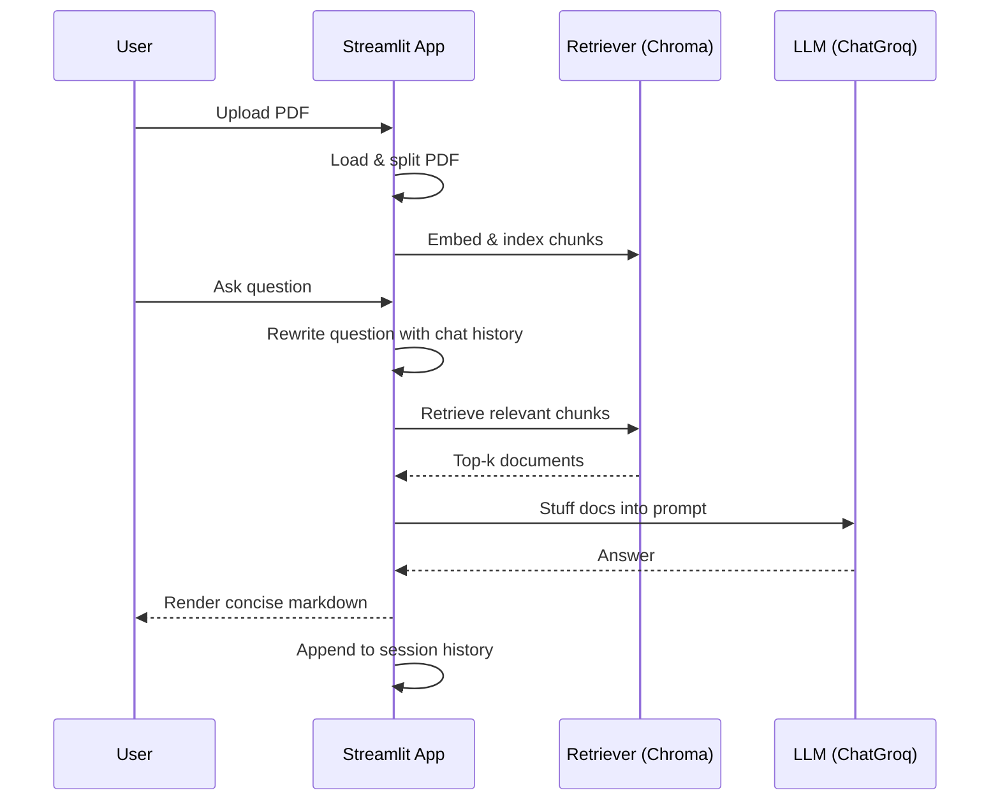

## Conversational RAG with PDF Uploads and Chat History


### What is this project?
**A Streamlit app for question-answering over your PDFs** using a modern Retrieval-Augmented Generation (RAG) pipeline. You upload a PDF, the app indexes it into a vector database, and you can chat conversationally with memory of prior turns. It reformulates follow-up questions into standalone ones, retrieves relevant chunks, and answers concisely.

- **UI**: `Streamlit`
- **RAG Orchestration**: `LangChain`
- **LLM**: `ChatGroq` (e.g., `openai/gpt-oss-120b`)
- **Embeddings**: `HuggingFaceEmbeddings` (`all-MiniLM-L6-v2`)
- **Vector Store**: `Chroma`
- **Loaders & Splitters**: `PyPDFLoader`, `RecursiveCharacterTextSplitter`

Key file(s):
- `app.py` — the Streamlit app
- `requirements.txt` — dependencies

### Features
- **PDF ingestion** with automatic chunking
- **Conversational memory** across turns
- **History-aware question rewriting** for better retrieval
- **Concise markdown answers** with retrieved context
- **One-click session clearing**

---

### Methods Used
- **Retrieval-Augmented Generation (RAG)**: Combines LLM reasoning with document retrieval to ground answers in your PDFs.
- **History-Aware Retrieval**: `create_history_aware_retriever` reformulates follow-ups using chat history.
- **Retrieval Chain**: `create_retrieval_chain` composes retrieval with an answer-generation chain.
- **Stuff Documents Chain**: `create_stuff_documents_chain(llm, prompt)` injects retrieved chunks into a structured prompt.
- **Session Memory**: `RunnableWithMessageHistory` persists chats per `session_id` using `ChatMessageHistory`.
- **Vector Indexing**: `HuggingFaceEmbeddings` + `Chroma` for fast semantic search.

---

### Architecture at a Glance
```mermaid
flowchart LR
    A[PDF Upload] --> B[PyPDFLoader]
    B --> C[RecursiveCharacterTextSplitter]
    C --> D[HuggingFaceEmbeddings\nall-MiniLM-L6-v2]
    D --> E[Chroma Vector DB]

    subgraph Conversational Loop
    F[User Question] --> G[History-Aware Question\nRewriter]
    G --> H[Retriever from Chroma]
    H --> I[Stuff Documents Chain\n(LLM Prompt)]
    I --> J[ChatGroq LLM]
    J --> K[Answer]
    K --> L[Chat History Store]
    L --> G
    end

    E <--> H
```

### Sequence Diagram


---

### Getting Started

#### 1) Clone and set up environment
```bash
git clone <your-repo-url>
cd "RAG Document & Q&A2"
python -m venv venv
venv\Scripts\activate  # Windows PowerShell
pip install -r requirements.txt
```

#### 2) Environment variables
Create a `.env` file in the project root:
```env
HF_TOKEN=your_huggingface_token
```
Notes:
- The app requests your **Groq API key** securely via the UI at runtime.
- Ensure the HF token has permission to pull the embedding model if needed.

#### 3) Run the app
```bash
streamlit run app.py
```

Open the local URL Streamlit prints (usually `http://localhost:8501`).

---

### Usage
1. Enter your **Groq API key** in the input field.
2. Optionally set a `Session ID` to keep multiple conversations separated.
3. Upload a single PDF file.
4. Ask questions; follow-ups will be context-aware.
5. Use the **Clear Session** button to reset the store.

---

### Configuration & Internals
- **LLM**: `ChatGroq(model_name="openai/gpt-oss-120b")`
- **Embeddings**: `HuggingFaceEmbeddings(model_name="all-MiniLM-L6-v2")`
- **Vector DB**: `Chroma.from_documents(...)`
- **Splitter**: `RecursiveCharacterTextSplitter(chunk_size=5000, chunk_overlap=500)`
- **Retriever**: `vectorstore.as_retriever()`
- **History-Aware Retriever**: `create_history_aware_retriever(llm, retriever, prompt)`
- **Answer Chain**: `create_stuff_documents_chain(llm, qa_prompt)`
- **RAG Chain**: `create_retrieval_chain(history_aware_retriever, chain)`
- **Conversation Wrapper**: `RunnableWithMessageHistory` with keys:
  - `input_messages_key="input"`
  - `history_messages_key="chat_history"`
  - `output_messages_key="answer"`

Prompts:
- Contextualizer prompt: rewrites user input into a standalone question.
- Answer prompt: instructs the LLM to be helpful, brief, and markdown-formatted.

---

### Screenshots (optional)
You can add screenshots here (UI home, chat, upload flow). Example placeholders:


---

### Troubleshooting
- **ImportError create_retriever_chain**: Use `create_retrieval_chain` from `langchain.chains`.
- **AttributeError input_variables**: Ensure `create_stuff_documents_chain(llm, prompt)` argument order.
- **RunnableWithMessageHistory init error**: Use `runnable=...` instead of `chain=`.
- **Missing packages**: Re-run `pip install -r requirements.txt` in the active venv.
- **No response / rate limits**: Verify Groq key validity and model availability.

---

### Tech Stack
- **Python** 3.10+
- **Streamlit** for UI
- **LangChain** for orchestration
- **Chroma** for vector search
- **HuggingFace** for embeddings
- **Groq** for LLM inference

---

### Roadmap (ideas)
- Multi-file upload and batch ingestion
- Source-citation rendering in answers
- Adjustable chunk sizes and top-k controls
- Persisted vector store across sessions


